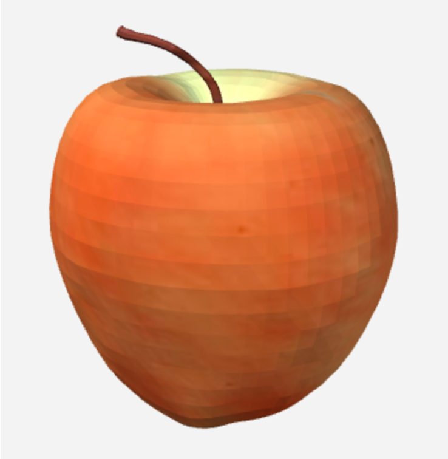
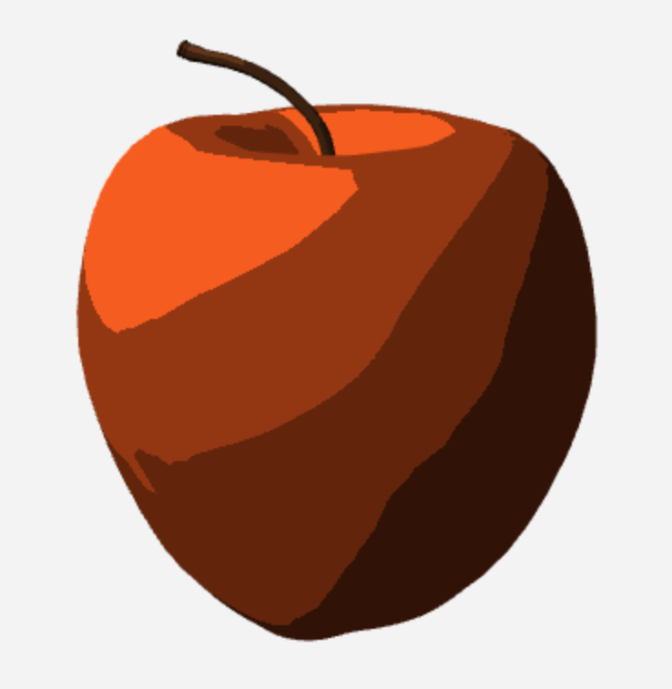

# Cézanne

This is a project showing varied shading algorithms with a simple apple.

[GLSL](https://en.wikipedia.org/wiki/OpenGL_Shading_Language) (OpenGL Shading Language) is mainly used for the shading effect, with the help of [Three.js](https://threejs.org).

## Project Name

> *With an apple I will astonish Paris.*
>
> \- Paul Cézanne

Paul Cézanne was a famous and influential Post-Impressionist artist, who drew a great number of apples of all kinds.

This project is intended to show my practice on **shading algorithms and implementations**.

## Rendering Results

### Original Model

### Cartoon Shading

## Reference

### General

- [WebGL 1.0 API Quick Reference Card - Page 1](https://www.khronos.org/files/webgl/webgl-reference-card-1_0.pdf)

### Cartoon Shading

- [shader-toon shading](https://sites.google.com/site/threejstuts/home/shader-toon)
- [Toon Shader – Version II](http://www.lighthouse3d.com/tutorials/glsl-12-tutorial/toon-shader-version-ii/)
- [three.js - toon shading](http://www.realtimerendering.com/erich/udacity/exercises/unit3_toon_solution3.html)

## Credits

The apple model is downloaded from [TF3FD](http://tf3dm.com/3d-model/apple-51047.html), with extra modification.
